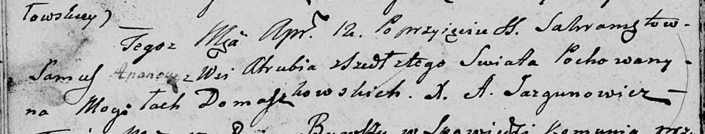

**Апанович Самусь (Apanowicz Samuś)**

12 апреля 1808 г -- отпевание (НИАБ 136-13-919, лист 19об, №12/1808-у
(ориг)).

**НИАБ 136-13-919:** Лист 19об. **Метрическая запись №12/1808-у
(ориг).**

{width="6.496527777777778in"
height="1.238888888888889in"}

Дедиловичская Покровская церковь. 12 апреля 1808 года. Метрическая
запись об отпевании.

Apanowicz Samuś -- умерший, с деревни Отруб, похоронен на кладбище
деревни Домашковичи.

Jazgunowicz Antoni -- ксёндз.
