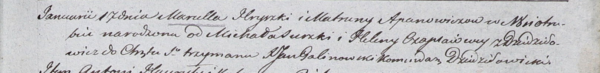

**Апанович Матруна (Apanowiczowa Matruna)**

17 января 1804 г -- крещение дочери Марцеллы (НИАБ 937-4-32, лист 10,
№1/1804-р).

**НИАБ 937-4-32:** Лист 10. **Метрическая запись №1/1804-р.**

{width="6.496527777777778in"
height="0.7958333333333333in"}

Дедиловичский костел Наисвятейшего Сердца Иисуса. 17 января 1804 года.
Метрическая запись о крещении.

Apanowiczowna Marcella -- дочь родителей с деревни Отруб.

Apanowicz Hryrzka -- отец.

Apanowiczowa Matruna -- мать.

Surzko Michał -- крестный отец.

Czaplaiowa Helena -- крестная мать, с деревни Дедиловичи.

Galinowski Joann -- ксёндз, комендант Дедиловичского костела.
