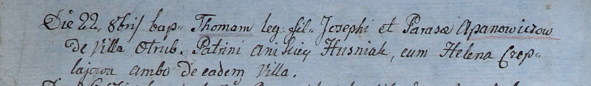
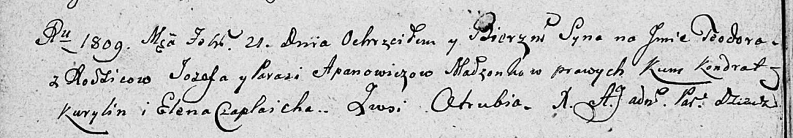

**Апанович Иосиф (Apanowicz Jozef, Joseph)**

22 октября 1805 г -- крещение сына Томаша (НИАБ 937-4-32, лист 12об,
№38/1805-р).

21 февраля 1809 г -- крещение сына Тодора (НИАБ 136-13-894, лист 73об,
№7/1809-р (ориг)).

**НИАБ 937-4-32:** Лист 12об. **Метрическая запись №38/1805-р.**

Дедиловичский костел Наисвятейшего Сердца Иисуса. 22 октября 1805 года.
Метрическая запись о крещении.

Apanowicz Thomasz -- сын крестьян с деревни Отруб.

Apanowicz Joseph -- отец.

Apanowiczowa Parasia -- мать.

Huzniak Anikiey -- крестный отец, с деревни Отруб.

Czapljowa Helena -- крестная мать, с деревни Отруб.

Linhart Hiacinthus -- ксёндз.

**НИАБ 136-13-894:** Лист 73об. **Метрическая запись №7/1809-р (ориг).**

Дедиловичская Покровская церковь. 21 февраля 1809 года. Метрическая
запись о крещении.

Apanowicz Teodor -- сын родителей с деревни Отруб.

Apanowicz Jozef -- отец.

Apanowiczowa Parasia -- мать.

Kurylin Kondrat -- кум.

Czaplaicha Elena -- кума.

Jazgunowicz Antoni -- ксёндз.
