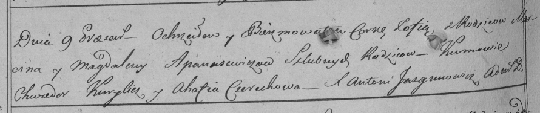

**Апанович Магдалена (Apanowiczowa Magdalena)**

9 апреля 1798 г -- крещение дочери Зофьи (НИАБ 136-13-894, лист 35об,
№14/1798-р (ориг)), (РГИА 823-2-18, лист 262об, №14/1798-р (коп)).

**НИАБ 136-13-894:** Лист 35-об. **Метрическая запись №14.**

{width="6.496527777777778in"
height="1.764099956255468in"}

Дедиловичская Покровская церковь. 9 апреля 1798 года. Метрическая запись
о крещении.

Apanowiczowna Zofia -- дочь родителей с деревни Отруб.

Apanowicz Marcin -- отец.

Apanowiczowa Magdalena -- мать.

Kurylicz Chwiedor - кум.

Cierachowa Ahafija - кума.

Jazgunowicz Antoni -- ксёндз.

**РГИА 823-2-18:** Лист 262об. **Метрическая запись №14/1798-р (коп).**

{width="6.496527777777778in"
height="1.3652777777777778in"}

Дедиловичская Покровская церковь. 9 апреля 1798 года. Метрическая запись
о крещении.

Apanowiczowna Zofia -- дочь \[родителей с деревни Отруб\].

Apanowicz Marcin -- отец.

Apanowiczowa Magdalena -- мать.

Kurylicz Chwiedor -- кум.

Cierechowa Ahafia -- кума.

Jazgunowicz Antoni -- ксёндз.
