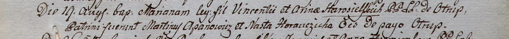

**Апанович Мартин (Apanowicz Marcin)**

9 апреля 1798 г -- крещение дочери Зофьи (НИАБ 136-13-894, лист 35об,
№14/1798-р (ориг)), (РГИА 823-2-18, лист 262об, №14/1798-р (коп)).

19 августа 1800 г -- крестный отец Марьяны, дочери Винцентия и Арины
Старосельских с деревни Отруб (НИАБ 937-4-32, лист 2, №26/1800-р).

**НИАБ 136-13-894:** Лист 35-об. **Метрическая запись №14.**

{width="6.496527777777778in"
height="1.764099956255468in"}

Дедиловичская Покровская церковь. 9 апреля 1798 года. Метрическая запись
о крещении.

Apanowiczowna Zofia -- дочь родителей с деревни Отруб.

Apanowicz Marcin -- отец.

Apanowiczowa Magdalena -- мать.

Kurylicz Chwiedor - кум.

Cierachowa Ahafija - кума.

Jazgunowicz Antoni -- ксёндз.

**РГИА 823-2-18:** Лист 262об. **Метрическая запись №14/1798-р (коп).**

{width="6.496527777777778in"
height="1.3652777777777778in"}

Дедиловичская Покровская церковь. 9 апреля 1798 года. Метрическая запись
о крещении.

Apanowiczowna Zofia -- дочь \[родителей с деревни Отруб\].

Apanowicz Marcin -- отец.

Apanowiczowa Magdalena -- мать.

Kurylicz Chwiedor -- кум.

Cierechowa Ahafia -- кума.

Jazgunowicz Antoni -- ксёндз.

**НИАБ 937-4-32:** Лист 2. **Метрическая запись №26/1800-р.**

Дедиловичский костел Наисвятейшего Сердца Иисуса. 19 августа 1800 года.
Метрическая запись о крещении.

{width="6.496527777777778in"
height="0.5131944444444444in"}

Starosielska Mariana -- дочь крестьян с деревни Отруб.

Starosielski Vincenti -- отец.

Starosielska Arina -- мать.

Apanowicz Martinusz -- крестный отец, с деревни Отруб.

Horauczicha Nasta -- крестная мать, с деревни Отруб.

Linhart Hyacinthus -- ксёндз.
