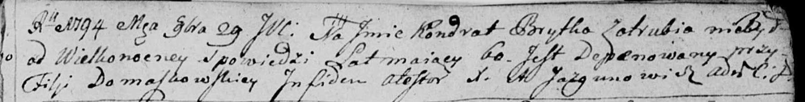

**Брытко Аврам (Brytko Awram)**

15 января 1800 г -- крестный отец Яна Винцента, сына Гаравцов Данилы и
Насты (НИАБ 136-13-894, лист 40об, №4/1800-р (ориг), НИАБ 136-13-949,
лист 101, №4/1800-р (коп)).

**НИАБ 136-13-894:** Лист 40об. **Метрическая запись №4/1800-р (ориг).**

{width="6.496527777777778in"
height="1.9411132983377077in"}

Дедиловичская Покровская церковь. 15 января 1800 года. Метрическая
запись о крещении.

Harawcow Jan Wincenty -- сын.

Harawec Daniła -- отец.

Harawcowa Nasta -- мать.

Brytko Awram -- кум, с деревни Отруб.

Szyłowa Marjana -- кума, с деревни Васильковка.

Jazgunowicz Antoni -- ксёндз.

**НИАБ 136-13-949:** Лист 101. **Метрическая запись №4/1800-р (коп).**

(См. тж.: РГИА 823-2-18, лист 274, №4/1800-р (коп), НИАБ 136-13-894,
лист 40об, №4/1800-р (ориг))

{width="6.496527777777778in"
height="1.5263888888888888in"}

Дедиловичская Покровская церковь. 15 января 1800 года. Метрическая
запись о крещении.

Harawec Jozef \[Jan\] Wincenty -- сын родителей с деревни Отруб.

Harawec Daniła -- отец.

Harawcowa Nastazya -- мать.

Brytka Awram -- кум, с деревни Отруб.

Szyłowa Marjana - кума, с деревни Васильковка.

Jazgunowicz Antoni -- ксёндз.
