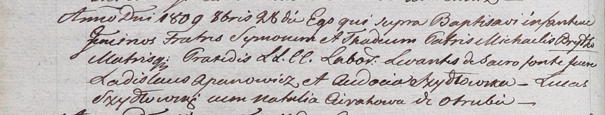

**Брытко Елена Михалова (Brytkowna Elena)**

4 июня 1811 г -- крещение (НИАБ 136-13-894, лист 81, №29/1811-р (ориг)).

**НИАБ 136-13-894:** Лист 81. **Метрическая запись №29/1811-р (ориг).**

{width="6.496527777777778in"
height="0.861599956255468in"}

Осовская Покровская церковь. 4 июня 1811 года. Метрическая запись о
крещении.

Brytkowna Elena -- дочь родителей с деревни Отруб.

Brytko Michał -- отец.

Brytkowa Praxeda -- мать.

Szyło Łukjan -- кум.

Kulnoszowa? Natalija -- кума.

Woyniewicz Tomasz -- ксёндз.
