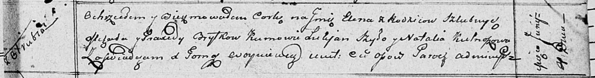

**Брытко Михал (Brytko Michał)**

11 октября 1808 г -- венчание с Парасей Михевич (НИАБ 136-13-920, лист
14, №5/1808-б (ориг)).

28 октября 1809 г -- крещение сыновей Сымона и Тадея (НИАБ 937-4-32,
лист 20об, №30/1809-р).

4 июня 1811 г -- крещение дочери Елены (НИАБ 136-13-894, лист 81,
№29/1811-р (ориг)).

**НИАБ 136-13-920:** Лист 14. **Метрическая запись №5/1808-б (ориг).**

{width="6.496527777777778in"
height="2.8878674540682416in"}

Дедиловичская Покровская церковь. 11 октября 1808 года. Метрическая
запись о венчании.

Brytka Michał -- жених, с деревни Отруб.

Michewiczowna Parasia -- невеста.

Huzniak Dzianis -- свидетель, с деревни Отруб.

Michewicz Hauryła -- свидетель.

Jazgunowicz Antoni -- ксёндз.

**НИАБ 937-4-32:** Лист 20об. **Метрическая запись №30/1809-р.**

{width="6.496527777777778in"
height="1.2430555555555556in"}

Дедиловичский костел Наисвятейшего Сердца Иисуса. 28 октября 1809 года.
Метрическая запись о крещении.

Brydko Symon -- сын крестьян с деревни Отруб.

Brydko Thadei -- сын крестьян с деревни Отруб.

Brydko Michael -- отец.

Brydkowa Praxeda -- мать.

Apanowicz Ładisław -- крестный отец.

Szydłowska Audocia -- крестная мать.

Szydłowski Łucas -- крестный отец.

Cierahowa Natalia -- крестная мать.

Miszkun Marcus -- ксёндз, комендант Дедиловичский.

**НИАБ 136-13-894:** Лист 81. **Метрическая запись №29/1811-р (ориг).**

{width="6.496527777777778in"
height="0.861599956255468in"}

Осовская Покровская церковь. 4 июня 1811 года. Метрическая запись о
крещении.

Brytkowna Elena -- дочь родителей с деревни Отруб.

Brytko Michał -- отец.

Brytkowa Praxeda -- мать.

Szyło Łukjan -- кум.

Kulnoszowa? Natalija -- кума.

Woyniewicz Tomasz -- ксёндз.
