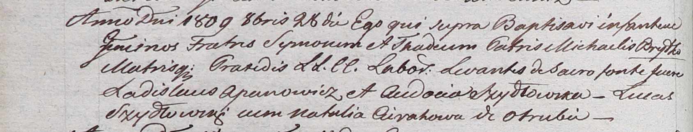

**Брытко Сымон Михалов (Brydko Symon)**

28 октября 1809 г -- крещение (НИАБ 937-4-32, лист 20об, №30/1809-р).

**НИАБ 937-4-32:** Лист 20об. **Метрическая запись №30/1809-р.**

Дедиловичский костел Наисвятейшего Сердца Иисуса. 28 октября 1809 года.
Метрическая запись о крещении.

Brydko Symon -- сын крестьян с деревни Отруб.

Brydko Thadei -- сын крестьян с деревни Отруб.

Brydko Michael -- отец.

Brydkowa Praxeda -- мать.

Apanowicz Ładisław -- крестный отец.

Szydłowska Audocia -- крестная мать.

Szydłowski Łucas -- крестный отец.

Cierahowa Natalia -- крестная мать.

Miszkun Marcus -- ксёндз, комендант Дедиловичский.
