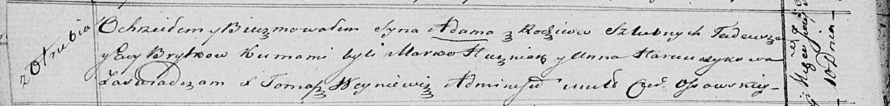

**Брытко Адам Тадеев (Brytko Adam)**

10 июня 1821 г -- крещение (НИАБ 136-13-894, лист 106об, №26/1821-р
(ориг)).

**НИАБ 136-13-894:** Лист 106об. **Метрическая запись №26/1821-р
(ориг).**

{width="6.496527777777778in"
height="0.7818099300087489in"}

Осовская Покровская церковь. 10 июня 1821 года. Метрическая запись о
крещении.

Brytko Adam -- сын родителей с деревни Отруб.

Brytko Tadeusz -- отец.

Brytkowa Ewa -- мать.

Huzniak Marko -- кум.

Harauczykowa Anna -- кума.

Woyniewicz Tomasz -- ксёндз.
