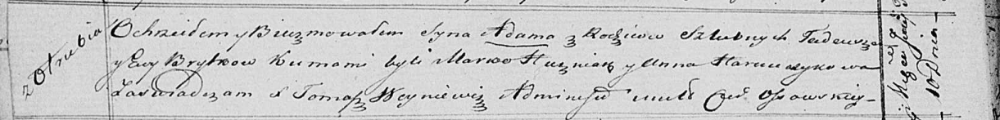

**Брытко (в девичестве Сушко) Ева (Brytkowa Ewa z Suszkow)**

14 января 1817 г -- венчание с молодым Тадеем Брытко с деревни Отруб
(НИАБ 136-13-920, лист 24, №2/1817-б (ориг)).

10 июня 1821 г -- крещение сына Адама (НИАБ 136-13-894, лист 106об,
№26/1821-р (ориг)).

**НИАБ 136-13-920:** Лист 24. **Метрическая запись №2/1817-б (ориг).**

{width="6.496527777777778in"
height="2.1724376640419947in"}

Осовская Покровская церковь. 14 января 1817 года. Запись о венчании.

Bryt Tadeusz -- жених, молодой, парафии Дедиловичской католической, с
деревни Отруб.

Suszkowna Ewa -- невеста, девка, с деревни Горелое.

Suszko Andrzey -- свидетель.

Huzniak Jan -- свидетель.

Woyniewicz Tomasz -- ксёндз.

**НИАБ 136-13-894:** Лист 106об. **Метрическая запись №26/1821-р
(ориг).**

{width="6.496527777777778in"
height="0.7818099300087489in"}

Осовская Покровская церковь. 10 июня 1821 года. Метрическая запись о
крещении.

Brytko Adam -- сын родителей с деревни Отруб.

Brytko Tadeusz -- отец.

Brytkowa Ewa -- мать.

Huzniak Marko -- кум.

Harauczykowa Anna -- кума.

Woyniewicz Tomasz -- ксёндз.
