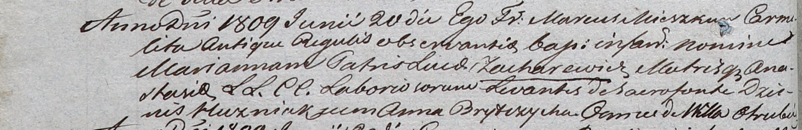

**Брытко Анна (Brytkowa Anna)**

7 августа 1804 г -- крестная мать Елены Марты, дочери Еськевичей
Змитрока и Агаты с деревни Отруб (НИАБ 136-13-894, лист 42, №29/1800-р
(ориг)).

9 августа 1805 г -- крещение сына Лаврентыя (НИАБ 136-13-894, лист 58,
№36/1805-р (ориг)).

20 июня 1809 г -- крестная мать Марьяны, дочери Луки и Анастасии
Захаревичей с деревни Отруб (НИАБ 937-4-32, лист 19об, №18/1809-р).

15 декабря 1812 г -- крещение дочери Настасьи (НИАБ 136-13-894, лист
85об, №57/1812-р (ориг)).

**НИАБ 136-13-894:** Лист 54об. **Метрическая запись №29/1804-р
(ориг).**

{width="6.496527777777778in"
height="1.55624343832021in"}

Дедиловичская Покровская церковь. 7 августа 1804 года. Метрическая
запись о крещении.

Jeskewiczowna Elena Marta -- дочь родителей с деревни Отруб.

Jeskewicz Zmitrok -- отец.

Jeskewiczowa Agata -- мать.

Harawczyk Daniło -- кум, с деревни Отруб.

Brytkowa Anna -- кума, с деревни Отруб.

Jazgunowicz Antoni -- ксёндз.

**НИАБ 136-13-894:** Лист 58. **Метрическая запись №36/1805-р (ориг).**

{width="6.496527777777778in"
height="0.8186876640419948in"}

Дедиловичская Покровская церковь. 9 августа 1805 года. Метрическая
запись о крещении.

Brytko Łaurenty -- сын родителей с деревни Отруб.

Brytko Chwiedor -- отец.

Brytkowa Anna -- мать.

Cierach Charyton -- кум.

Pozniakowa Anna, JP -- кума, шляхтянка.

Jazgunowicz Antoni -- ксёндз.

**НИАБ 937-4-32:** Лист 19об. **Метрическая запись №18/1809-р.**

{width="6.496527777777778in"
height="1.054861111111111in"}

Дедиловичский костел Наисвятейшего Сердца Иисуса. 20 июня 1809 года.
Метрическая запись о крещении.

Zacharewiczowna Marianna -- дочь крестьян с деревни Отруб.

Zacharewicz Łuca -- отец.

Zacharewiczowa Anastasia -- мать.

Huzniak Dzienis -- крестный отец, с деревни Отруб.

Brytczycha Anna -- крестная мать, с деревни Отруб.

Miszkun Marcus -- ксёндз.

**НИАБ 136-13-894:** Лист 85об. **Метрическая запись №57/1812-р
(ориг).**

{width="6.496527777777778in"
height="0.99167760279965in"}

Осовская Покровская церковь. 15 декабря 1812 года. Метрическая запись о
крещении.

Brytkowa Nastazija -- дочь родителей с деревни Отруб.

Brytko Chwiedor -- отец.

Brytkowa Anna -- мать.

Cierach Charyton -- кум.

Hramowiczowa Zofija -- кума.

Woyniewicz Tomasz -- ксёндз.
