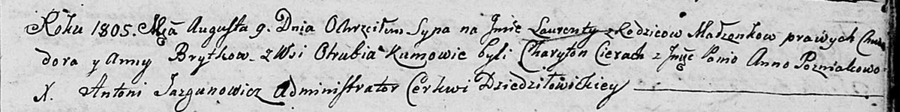

**Брытко Лавренты Хведоров (Brytko Łaurenty)**

9 августа 1805 г -- крещение (НИАБ 136-13-894, лист 58, №36/1805-р
(ориг)).

**НИАБ 136-13-894:** Лист 58. **Метрическая запись №36/1805-р (ориг).**

Дедиловичская Покровская церковь. 9 августа 1805 года. Метрическая
запись о крещении.

Brytko Łaurenty -- сын родителей с деревни Отруб.

Brytko Chwiedor -- отец.

Brytkowa Anna -- мать.

Cierach Charyton -- кум.

Pozniakowa Anna, JP -- кума, шляхтянка.

Jazgunowicz Antoni -- ксёндз.
