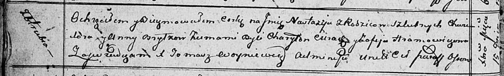

**Брытко Настасья Хведорова (Brytkowna Nastazija)**

15 декабря 1812 г -- крещение (НИАБ 136-13-894, лист 85об, №57/1812-р
(ориг)).

**НИАБ 136-13-894:** Лист 85об. **Метрическая запись №57/1812-р
(ориг).**

Осовская Покровская церковь. 15 декабря 1812 года. Метрическая запись о
крещении.

Brytkowa Nastazija -- дочь родителей с деревни Отруб.

Brytko Chwiedor -- отец.

Brytkowa Anna -- мать.

Cierach Charyton -- кум.

Hramowiczowa Zofija -- кума.

Woyniewicz Tomasz -- ксёндз.
