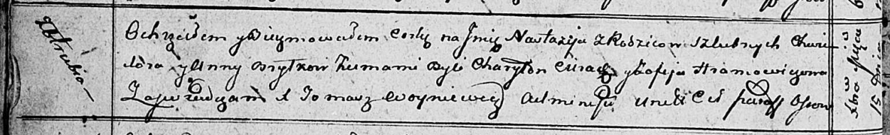

**Брытко Хведор (Brytko Chwiedor)**

30 апреля 1805 г -- крестный отец Миколая Романа, сына Юшкевичей Леона и
Марыси с деревни Отруб (НИАБ 136-13-894, лист 57, №23/1805-р (ориг)).

9 августа 1805 г -- крещение сына Лаврентыя (НИАБ 136-13-894, лист 58,
№36/1805-р (ориг)).

15 декабря 1812 г -- крещение дочери Настасьи (НИАБ 136-13-894, лист
85об, №57/1812-р (ориг)).

**НИАБ 136-13-894:** Лист 57. **Метрическая запись №23/1805-р (ориг).**

{width="6.496527777777778in"
height="1.1304724409448819in"}

Дедиловичская Покровская церковь. 30 апреля 1805 года. Метрическая
запись о крещении.

Juszkiewicz Mikołay Roman -- сын родителей с деревни Отруб.

Juszkiewicz Leon -- отец.

Juszkiewiczowa Marysia -- мать.

Brytka Chwiedor -- кум, с деревни Отруб.

Szyłowa Zosia -- кума, с деревни Отруб.

Jazgunowicz Antoni -- ксёндз.

**НИАБ 136-13-894:** Лист 58. **Метрическая запись №36/1805-р (ориг).**

{width="6.496527777777778in"
height="0.8186876640419948in"}

Дедиловичская Покровская церковь. 9 августа 1805 года. Метрическая
запись о крещении.

Brytko Łaurenty -- сын родителей с деревни Отруб.

Brytko Chwiedor -- отец.

Brytkowa Anna -- мать.

Cierach Charyton -- кум.

Pozniakowa Anna, JP -- кума, шляхтянка.

Jazgunowicz Antoni -- ксёндз.

**НИАБ 136-13-894:** Лист 85об. **Метрическая запись №57/1812-р
(ориг).**

{width="6.496527777777778in"
height="0.99167760279965in"}

Осовская Покровская церковь. 15 декабря 1812 года. Метрическая запись о
крещении.

Brytkowa Nastazija -- дочь родителей с деревни Отруб.

Brytko Chwiedor -- отец.

Brytkowa Anna -- мать.

Cierach Charyton -- кум.

Hramowiczowa Zofija -- кума.

Woyniewicz Tomasz -- ксёндз.
