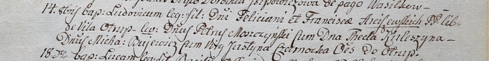

**Буевич Михал (Bujewicz Michael)**

14 октября 1800 г -- крестный отец Людовика, сына шляхтичей Фелициана и
Франциски Арцишевских с деревни Отруб (НИАБ 937-4-32, лист 3,
№34/1800-р).

**НИАБ 937-4-32:** Лист 3. **Метрическая запись №34/1800-р.**

Дедиловичский костел Наисвятейшего Сердца Иисуса. 14 октября 1800 года.
Метрическая запись о крещении.

{width="6.496527777777778in"
height="0.8215277777777777in"}

Arciszewski Ludowic -- сын шляхтичей с деревни Отруб.

Arciszewski Felician -- отец.

Arciszewska Francisca -- мать.

Moszczynski Petrus -- крестный отец, шляхтич.

Kuleszyna Thecla -- крестная мать, шляхтянка.

Bujewicz Michael - ассистент, шляхтич, с деревни Отруб.

Czarnocka Justina - ассистентка, шляхтянка, девица, с деревни Отруб.

Linhart Hyacinthus -- ксёндз.
