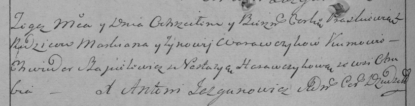

**Варавич Зыновия (Warawczykowa Zynowija)**

12 октября 1796 г -- крещение дочери Параскевии (НИАБ 136-13-894, лист
31, №88/1796-р (ориг)), (РГИА 823-2-18, лист 257об, №56/1796-р (коп)).

**НИАБ 136-13-894:** Лист 31. **Метрическая запись №88/1796-р (ориг).**

{width="6.496527777777778in"
height="1.095605861767279in"}

Дедиловичская Покровская церковь. 12 октября 1796 года. Метрическая
запись о крещении.

Warawczykowna Paraskiewia -- дочь родителей с деревни Отруб.

Warawczyk Markian -- отец.

Warawczykowa Zynowija -- мать.

Szapielewicz Chwiedor -- кум.

Harawczykowa Nastazyia - кума.

Jazgunowicz Antoni -- ксёндз.

**РГИА 823-2-18:** Лист 257об. **Метрическая запись №56/1796-р (коп).**

{width="6.496527777777778in"
height="1.6590277777777778in"}

Дедиловичская Покровская церковь. \[12\] октября 1796 года. Метрическая
запись о крещении.

Warawczykowna Praskiewia -- дочь родителей с деревни Отруб.

Warawczyk Markian -- отец.

Warawczykowa Zynowija -- мать.

Szapielewicz Chwiedor -- кум.

Harawczykowa Nastazya -- кума.

Jazgunowicz Antoni -- ксёндз.
