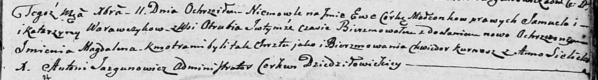

**Варавчик Ева Самуэлева (Warawczykowna Ewa Magdalena)**

11 декабря 1804 г -- крещение (НИАБ 136-13-894, лист 56, №60/1804-р
(ориг)).

**НИАБ 136-13-894:** Лист 56. **Метрическая запись №60/1804-р (ориг).**

{width="6.496527777777778in"
height="0.8709864391951007in"}

Дедиловичская Покровская церковь. 11 декабря 1804 года. Метрическая
запись о крещении.

Warawczykowna Ewa Magdalena -- дочь родителей с деревни Отруб.

Warawczyk Samuel -- отец.

Warawczykowa Katerzyna -- мать.

Kurnesz Chwiedor -- кум.

Sielicka Anna -- кума.

Jazgunowicz Antoni -- ксёндз.
