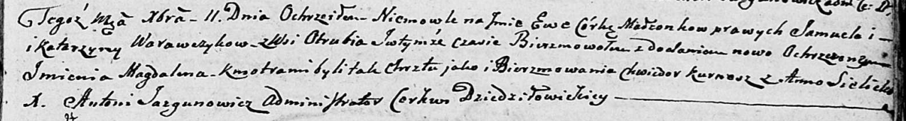

**Варавчик Самуэль (Warawczyk Samuel)**

11 декабря 1804 г -- крещение дочери Евы Магдалены (НИАБ 136-13-894,
лист 56, №60/1804-р (ориг)).

**НИАБ 136-13-894:** Лист 56. **Метрическая запись №60/1804-р (ориг).**

Дедиловичская Покровская церковь. 11 декабря 1804 года. Метрическая
запись о крещении.

Warawczykowna Ewa Magdalena -- дочь родителей с деревни Отруб.

Warawczyk Samuel -- отец.

Warawczykowa Katerzyna -- мать.

Kurnesz Chwiedor -- кум.

Sielicka Anna -- кума.

Jazgunowicz Antoni -- ксёндз.
