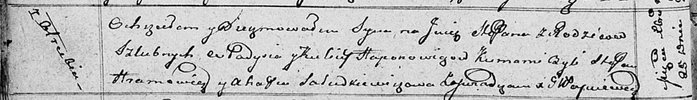

**Гапанович Степан Владысев (Hapanowicz Stefan)**

25 декабря 1811 г -- крещение (НИАБ 136-13-894, лист 82об, №66/1811-р
(ориг)).

**НИАБ 136-13-894:** Лист 82об. **Метрическая запись №66/1811-р
(ориг).**

{width="6.496527777777778in"
height="0.9413899825021872in"}

Осовская Покровская церковь. 25 декабря 1811 года. Метрическая запись о
крещении.

Haponowicz Stefan -- сын родителей с деревни Отруб.

Haponowicz Władyś -- отец.

Haponowiczowa Kulina -- мать.

Hramowicz Stefan -- кум.

Saładkiewiczowa Ahafija -- кума.

Woyniewicz Tomasz -- ксёндз.
