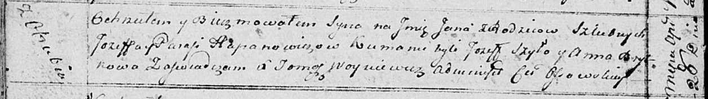
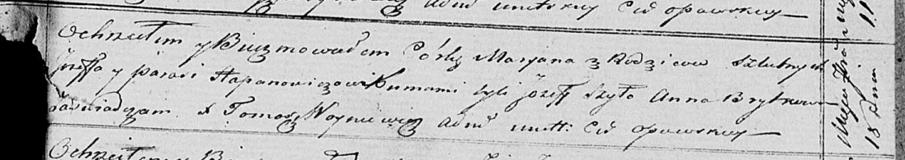

**Гапанович Парася (Hapanowiczowa Parasia)**

28 апреля 1815 г -- крещение сына Яна (НИАБ 136-13-894, лист 92об,
№26/1815-р (ориг)).

30 августа 1818 г -- крещение дочери Анны (НИАБ 136-13-894, лист 99,
№28/1818-р (ориг)).

18 сентября 1821 г -- крещение дочери Марьяна (НИАБ 136-13-894, лист
107, №44/1821-р (ориг)).

**НИАБ 136-13-894:** Лист 92об. **Метрическая запись №26/1815-р
(ориг).**

Осовская Покровская церковь. 28 апреля 1815 года. Метрическая запись о
крещении.

Hapanowicz Jan -- сын родителей с деревни Отруб.

Hapanowicz Jozef -- отец.

Hapanowivzowa Parasia -- мать.

Szyło Jozef -- кум.

Brytkowa Anna -- кума.

Woyniewicz Tomasz -- ксёндз.

**НИАБ 136-13-894:** Лист 99. **Метрическая запись №28/1818-р (ориг).**

Осовская Покровская церковь. 30 августа 1818 года. Метрическая запись о
крещении.

Hapanowiczowna Anna -- дочь родителей с деревни Отруб.

Hapanowicz Jozef -- отец.

Hapanowiczowa Parasia -- мать.

Szyło Jozef -- кум.

Brytkowa Anna -- кума.

Woyniewicz Tomasz -- ксёндз.

**НИАБ 136-13-894:** Лист 107. **Метрическая запись №44/1821-р (ориг).**

Осовская Покровская церковь. 18 сентября 1821 года. Метрическая запись о
крещении.

Hapanowiczowna Marjana -- дочь родителей с деревни \[Отруб\].

Hapanowicz Jozef -- отец.

Hapanowiczowa Parasia -- мать.

Szyło Jozef -- кум.

Brytkowa Anna -- кума.

Woyniewicz Tomasz -- ксёндз.
