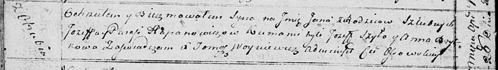

**Гапанович Ян Иосифов (Hapanowicz Jan)**

28 апреля 1815 г -- крещение (НИАБ 136-13-894, лист 92об, №26/1815-р
(ориг)).

**НИАБ 136-13-894:** Лист 92об. **Метрическая запись №26/1815-р
(ориг).**

Осовская Покровская церковь. 28 апреля 1815 года. Метрическая запись о
крещении.

Hapanowicz Jan -- сын родителей с деревни Отруб.

Hapanowicz Jozef -- отец.

Hapanowivzowa Parasia -- мать.

Szyło Jozef -- кум.

Brytkowa Anna -- кума.

Woyniewicz Tomasz -- ксёндз.
