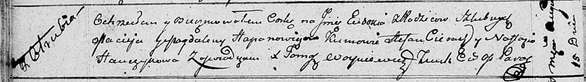

**Гапанович Евдокия Мацеева (Hapanowiczowna Eudokija)**

15 августа 1811 г -- крещение (НИАБ 136-13-894, лист 81об, №41/1811-р
(ориг)).

**НИАБ 136-13-894:** Лист 81об. **Метрическая запись №41/1811-р
(ориг).**

Осовская Покровская церковь. 15 августа 1811 года. Метрическая запись о
крещении.

Hapanowiczowna Eudokija -- дочь родителей с деревни Отруб.

Hapanowicz Maciey -- отец.

Hapanowiczowa Magdalena -- мать.

Cierach Stefan -- кум.

Hanczykowa Nastazya -- кума.

Woyniewicz Tomasz -- ксёндз.

.
