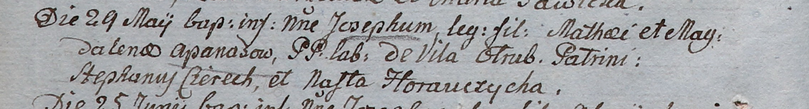

**Гапанович Иосиф Мацеев (Apanas Joseph)**

29 мая 1805 г -- крещение (НИАБ 937-4-32, лист 11об, №21/1805-р).

**НИАБ 937-4-32:** Лист 11об. **Метрическая запись №21/1805-р.**

{width="6.496527777777778in"
height="0.8777777777777778in"}

Дедиловичский костел Наисвятейшего Сердца Иисуса. 29 мая 1805 года.
Метрическая запись о крещении.

Apanas Joseph -- сын крестьян с деревни Отруб.

Apanas Mathei -- отец.

Apanasowa Magdalena -- мать.

Cierech Stephan -- крестный отец.

Horauczycha Nasta -- крестная мать.

Linhart Hiacinthus -- ксёндз.
