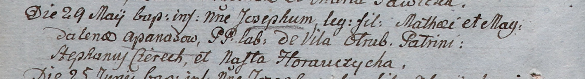

**Гапанович Мацей (Hapanowicz, Apanas Maciey, Mathei)**

29 мая 1805 г -- крещение сына Иосифа (НИАБ 937-4-32, лист 11об,
№21/1805-р).

15 августа 1811 г -- крещение дочери Евдокии (НИАБ 136-13-894, лист
81об, №41/1811-р (ориг)).

27 июля 1819 г -- крещение сына Борыса (НИАБ 136-13-894, лист 101об,
№41/1819-р (ориг)).

**НИАБ 937-4-32:** Лист 11об. **Метрическая запись №21/1805-р.**

Дедиловичский костел Наисвятейшего Сердца Иисуса. 29 мая 1805 года.
Метрическая запись о крещении.

Apanas Joseph -- сын крестьян с деревни Отруб.

Apanas Mathei -- отец.

Apanasowa Magdalena -- мать.

Cierech Stephan -- крестный отец.

Horauczycha Nasta -- крестная мать.

Linhart Hiacinthus -- ксёндз.

**НИАБ 136-13-894:** Лист 81об. **Метрическая запись №41/1811-р
(ориг).**

Осовская Покровская церковь. 15 августа 1811 года. Метрическая запись о
крещении.

Hapanowiczowna Eudokija -- дочь родителей с деревни Отруб.

Hapanowicz Maciey -- отец.

Hapanowiczowa Magdalena -- мать.

Cierach Stefan -- кум.

Hanczykowa Nastazya -- кума.

Woyniewicz Tomasz -- ксёндз.

**НИАБ 136-13-894:** Лист 101об. **Метрическая запись №41/1819-р
(ориг).**

Осовская Покровская церковь. 27 июля 1819 года. Метрическая запись о
крещении.

Hapanowicz Borys -- сын родителей с деревни Отруб.

Hapanowicz Maciey -- отец.

Hapanowiczowa Magdalena -- мать.

Cierach Adam -- кум.

Hapanowiczowa Katerzyna -- кума.

Woyniewicz Tomasz -- ксёндз.
