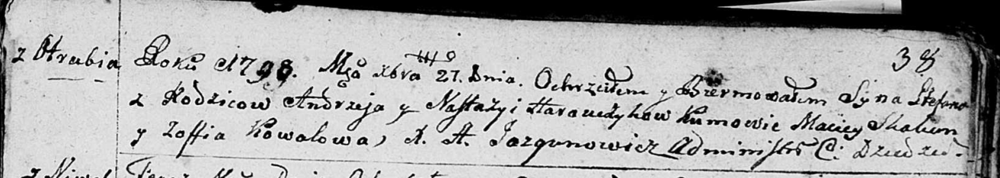
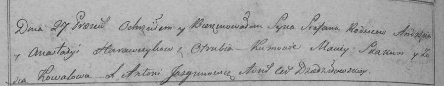

**Горавчик Андрей (Harauczyk Andrzey)**

27 декабря 1798 г -- крещение сына Стефана (НИАБ 136-13-894, лист 38,
№64/1798-р (коп)), (РГИА 823-2-18, лист 267об, №65/1798-р (коп)).

**НИАБ 136-13-894:** Лист 38. **Метрическая запись №64/1798-р (ориг).**

Дедиловичская Покровская церковь. 27 декабря 1798 года. Метрическая
запись о крещении.

Harauczyk Stefan -- сын родителей с деревни Отруб.

Harauczyk Andrzey -- отец.

Harauczykowa Nastazyia -- мать.

Skakun Maciey - кум.

Kowalowa Zofia - кума.

Jazgunowicz Antoni -- ксёндз.

**РГИА 823-2-18:** Лист 267об. **Метрическая запись №65/1798-р (коп).**

Дедиловичская Покровская церковь. 27 декабря 1798 года. Метрическая
запись о крещении.

Harawczyk Stefan -- сын родителей с деревни Отруб.

Harawczyk Andrzey -- отец.

Harawczykowa Anastazya -- мать.

Skakun Maciey -- кум.

Kowalowa Zosia -- кума.

Jazgunowicz Antoni -- ксёндз.
