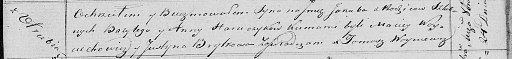

**Горавчик Якуб Базылиев (Harauczyk Jakub)**

24 октября 1820 г -- крещение (НИАБ 136-13-894, лист 105, №36/1820-р
(коп)).

**НИАБ 136-13-894:** Лист 105. **Метрическая запись №36/1820-р (ориг).**

Осовская Покровская церковь. 24 октября 1820 года. Метрическая запись о
крещении.

Harauczyk Jakub -- сын родителей с деревни Отруб.

Harauczyk Bazyli -- отец.

Harauczykowa Anna -- мать.

Woyciechowicz Maciey -- кум.

Brytkowa Justyna -- кума.

Woyniewicz Tomasz -- ксёндз.
