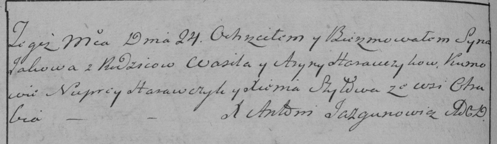

**Горавчик Арына (Harauczykowa Aryna)**

24 ноября 1785 г -- крещение сына Якова (РГИА 823-2-18, лист 230об,
№29/1785-р (коп)).

**РГИА 823-2-18:** Лист 230об. **Метрическая запись №29/1785-р (коп).**

Дедиловичская Покровская церковь. 24 ноября 1785 года. Метрическая
запись о крещении.

Harauczyk Jakow -- сын родителей с деревни Отруб.

Harauczyk Wasil -- отец.

Harauczykowa Aryna -- мать.

Harauczyk Nuprey -- кум.

Szyłowa Xienia - кума.

Jazgunowicz Antoni -- ксёндз.
