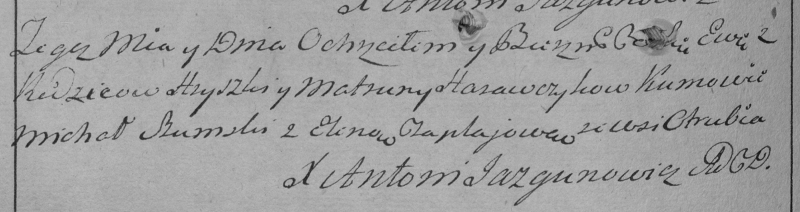

**Горавчик Ева Грышкова (Harauczykowna Ewa)**

18 января 1797 г -- крещение (НИАБ 136-13-894, лист 32, №8/1797-р
(ориг)), (РГИА 823-2-18, лист 258об, №8/1797-р (коп)).

**НИАБ 136-13-894:** Лист 32. **Метрическая запись №8/1797-р (ориг).**

{width="6.496527777777778in"
height="1.1512576552930884in"}

Дедиловичская Покровская церковь. 18 января 1797 года. Метрическая
запись о крещении.

Harauczykowna Ewa -- дочь родителей с деревни Отруб.

Harauczyk Hryszka -- отец.

Harauszykowa Matruna -- мать.

Szumski Michał - кум.

Czaplajowa Elena - кума.

Jazgunowicz Antoni -- ксёндз.

**РГИА 823-2-18:** Лист 258об. **Метрическая запись №8/1797-р (коп).**

{width="6.496527777777778in"
height="1.7215277777777778in"}

Дедиловичская Покровская церковь. 18 января 1797 года. Метрическая
запись о крещении.

Harawczykowna Ewa -- дочь родителей с деревни Отруб.

Harawczyk Hryszka -- отец.

Harawczykowa Matruna -- мать.

Szumski Michał -- кум.

Czaplajowa Elena -- кума.

Jazgunowicz Antoni -- ксёндз.
