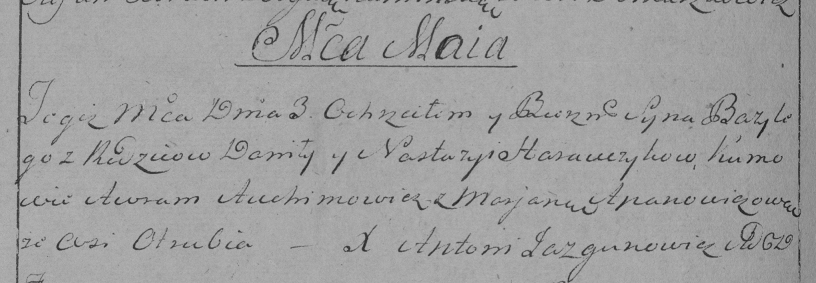

**Горавчик Базылий Данилов (Harauczyk Bazyli)**

3 мая 1797 г -- крещение (НИАБ 136-13-894, лист 33, №27/1797-р (коп)),
(РГИА 823-2-18, лист 259об, №20/1797-р (коп)).

**НИАБ 136-13-894:** Лист 33. **Метрическая запись №27/1797-р (ориг).**

{width="6.496527777777778in"
height="0.99167760279965in"}

Дедиловичская Покровская церковь. 3 мая 1797 года. Метрическая запись о
крещении.

Harauczyk Bazyli -- сын родителей с деревни Отруб.

Harauczyk Daniła -- отец.

Harauczykowa Nastazyia -- мать.

Auchimowicz Awram - кум.

Apanowiczowa Marjana - кума.

Jazgunowicz Antoni -- ксёндз.

**РГИА 823-2-18:** Лист 259об. **Метрическая запись №20/1797-р (коп).**

{width="6.496527777777778in"
height="2.2527777777777778in"}

Дедиловичская Покровская церковь. 3 мая 1797 года. Метрическая запись о
крещении.

Harawczyk Bazyli -- сын родителей с деревни Отруб.

Harawczyk Daniło -- отец.

Harawczykowa Nastazya -- мать.

Auchimowicz Awram -- кум.

Apanowiczowa Marjana -- кума.

Jazgunowicz Antoni -- ксёндз.
