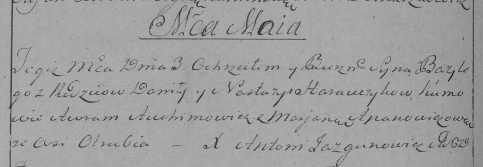

**Горавчик Данила (Harauczyk Daniła, Daniel)**

2 февраля 1791 г -- венчание с Настасьей Гузняк (НИАБ 136-13-894, лист
69об, №9/1791-б (коп)).

3 мая 1797 г -- крещение сына Базылия (НИАБ 136-13-894, лист 33,
№27/1797-р (коп)), (РГИА 823-2-18, лист 259об, №20/1797-р (коп)).

15 января 1800 г -- крещение сына Яна Винцента (НИАБ 136-13-894, лист
40об, №4/1800-р (ориг), РГИА 823-2-18, лист 274, №4/1800-р (коп), НИАБ
136-13-949, лист 101, №4/1800-р (коп)).

7 октября 1800 г -- крестный отец Текли Барбары, дочери Еськевичей
Змитрока и Агаты с деревни Отруб (НИАБ 136-13-894, лист 42, №29/1800-р
(ориг), НИАБ 136-13-949, лист 103об, №32/1800-р (коп)).

25 апреля 1804 г -- крещение сына Ежи (НИАБ 937-4-32, лист 10,
№7/1804-р).

7 августа 1804 г -- крестный отец Елены Марты, дочери Еськевичей
Змитрока и Агаты с деревни Отруб (НИАБ 136-13-894, лист 42, №29/1800-р
(ориг)).

9 июля 1807 г -- крещение дочери Марии (НИАБ 937-4-32, лист 15об,
№9/1807-р).

Лист 69об. **Метрическая запись №9/1791-б (ориг).**

{width="6.496527777777778in"
height="1.3946511373578303in"}

Дедиловичская Покровская церковь. 2 февраля 1791 года. Метрическая
запись о венчании.

Harauczyk Daniła -- жених, с деревни Отруб.

Huzniakowna Nastazya -- невеста.

Hanczyn Hauryła -- свидетель.

Szwiedzinkiewicz Jozef -- свидетель.

Huzniak Anikey -- свидетель.

Jazgunowicz Antoni -- ксёндз.

**НИАБ 136-13-894:** Лист 33. **Метрическая запись №27/1797-р (ориг).**

{width="6.496527777777778in"
height="0.99167760279965in"}

Дедиловичская Покровская церковь. 3 мая 1797 года. Метрическая запись о
крещении.

Harauczyk Bazyli -- сын родителей с деревни Отруб.

Harauczyk Daniła -- отец.

Harauczykowa Nastazyia -- мать.

Auchimowicz Awram - кум.

Apanowiczowa Marjana - кума.

Jazgunowicz Antoni -- ксёндз.

**РГИА 823-2-18:** Лист 259об. **Метрическая запись №20/1797-р (коп).**

{width="6.496527777777778in"
height="2.2527777777777778in"}

Дедиловичская Покровская церковь. 3 мая 1797 года. Метрическая запись о
крещении.

Harawczyk Bazyli -- сын родителей с деревни Отруб.

Harawczyk Daniło -- отец.

Harawczykowa Nastazya -- мать.

Auchimowicz Awram -- кум.

Apanowiczowa Marjana -- кума.

Jazgunowicz Antoni -- ксёндз.

**НИАБ 136-13-894:** Лист 40об. **Метрическая запись №4/1800-р (ориг).**

{width="6.496527777777778in"
height="1.9411132983377077in"}

Дедиловичская Покровская церковь. 15 января 1800 года. Метрическая
запись о крещении.

Harawcow Jan Wincenty -- сын родителей с деревни \[Отруб\].

Harawec Daniła -- отец.

Harawcowa Nasta -- мать.

Brytko Awram -- кум, с деревни Отруб.

Szyłowa Marjana -- кума, с деревни Васильковка.

Jazgunowicz Antoni -- ксёндз.

**РГИА 823-2-18:** Лист 274. **Метрическая запись №4/1800-р (коп).**

{width="6.496527777777778in"
height="2.5243055555555554in"}

Дедиловичская Покровская церковь. 15 января 1800 года. Метрическая
запись о крещении.

Harawiec Jan Wincenty -- сын.

Harawiec Daniło -- отец.

Harawcowa Nasta -- мать.

Brytka Awram -- кум, с деревни Отруб.

Szyłowa Marjana -- кума, с деревни Васильковка.

Jazgunowicz Antoni -- ксёндз.

**НИАБ 136-13-949:** Лист 103об. **Метрическая запись №32/1800-р
(коп).**

(См. тж.: НИАБ 136-13-894, лист 42, №29/1800-р (ориг))

{width="6.496527777777778in"
height="0.8034722222222223in"}

Дедиловичская Покровская церковь. 7 октября 1800 года. Метрическая
запись о крещении.

Zieskiewiczowna \[Jeśkiewiczowna\] Tekla Barbara -- дочь родителей с
деревни Отруб.

Zieskiewicz \[Jeśkiewicz\] Zmitrok -- отец.

Zieskiewiczowa \[Jeśkiewiczowa\] Agata -- мать.

Harauczyk Daniło -- кум, с деревни Отруб.

Brytkowa Xienia - кума, с деревни Отруб.

Jazgunowicz Antoni -- ксёндз.

**НИАБ 136-13-949:** Лист 101. **Метрическая запись №4/1800-р (коп).**

(См. тж.: РГИА 823-2-18, лист 274, №4/1800-р (коп), НИАБ 136-13-894,
лист 40об, №4/1800-р (ориг))

{width="6.496527777777778in"
height="1.5263888888888888in"}

Дедиловичская Покровская церковь. 15 января 1800 года. Метрическая
запись о крещении.

Harawec Jozef \[Jan\] Wincenty -- сын родителей с деревни Отруб.

Harawec Daniła -- отец.

Harawcowa Nastazya -- мать.

Brytka Awram -- кум, с деревни Отруб.

Szyłowa Marjana - кума, с деревни Васильковка.

Jazgunowicz Antoni -- ксёндз.

**НИАБ 937-4-32:** Лист 10. **Метрическая запись №7/1804-р.**

{width="6.496527777777778in"
height="0.6777777777777778in"}

Дедиловичский костел Наисвятейшего Сердца Иисуса. 25 апреля 1804 года.
Метрическая запись о крещении.

Hrawczyk Jerzy -- сын родителей с деревни Отруб.

Hrawczyk Daniła -- отец.

Hrawczykowa Nasta -- мать.

Brytko Chwiedor -- крестный отец.

Apanowiczowa Nasta -- крестная мать.

Galinowski Joann -- ксёндз, комендант Дедиловичского костела.

**НИАБ 136-13-894:** Лист 54об. **Метрическая запись №29/1804-р
(ориг).**

{width="6.496527777777778in"
height="1.55624343832021in"}

Дедиловичская Покровская церковь. 7 августа 1804 года. Метрическая
запись о крещении.

Jeskewiczowna Elena Marta -- дочь родителей с деревни Отруб.

Jeskewicz Zmitrok -- отец.

Jeskewiczowa Agata -- мать.

Harawczyk Daniło -- кум, с деревни Отруб.

Brytkowa Anna -- кума, с деревни Отруб.

Jazgunowicz Antoni -- ксёндз.

**НИАБ 937-4-32:** Лист 15об. **Метрическая запись №9/1807-р.**

{width="6.496527777777778in"
height="2.147222222222222in"}

Дедиловичский костел Наисвятейшего Сердца Иисуса. 9 июня 1807 года.
Метрическая запись о крещении.

Harauczykowna Maria -- дочь крестьян с деревни Отруб.

Harauczyk Daniel -- отец.

Harauczykowa Annastazia -- мать.

Brytka Theodor -- крестный отец.

Aponowiczowa Anna -- крестная мать, с деревни Отруб.

Zychowski Gabriel -- ксёндз.
