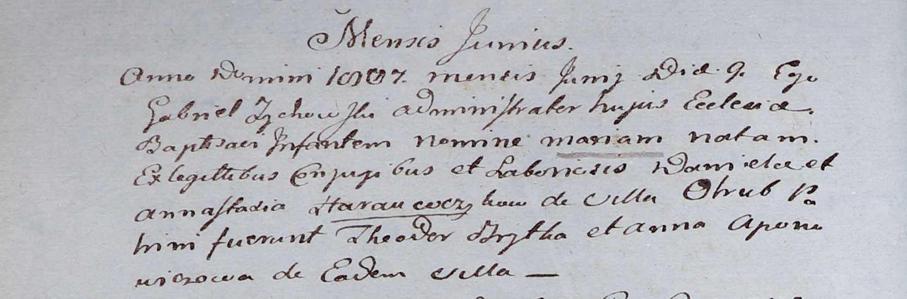

**Горавчик Мария Данилова (Harauczykowna Maria)**

9 июля 1807 г -- крещение (НИАБ 937-4-32, лист 15об, №9/1807-р).

**НИАБ 937-4-32:** Лист 15об. **Метрическая запись №9/1807-р.**

Дедиловичский костел Наисвятейшего Сердца Иисуса. 9 июня 1807 года.
Метрическая запись о крещении.

Harauczykowna Maria -- дочь крестьян с деревни Отруб.

Harauczyk Daniel -- отец.

Harauczykowa Annastazia -- мать.

Brytka Theodor -- крестный отец.

Aponowiczowa Anna -- крестная мать, с деревни Отруб.

Zychowski Gabriel -- ксёндз.
