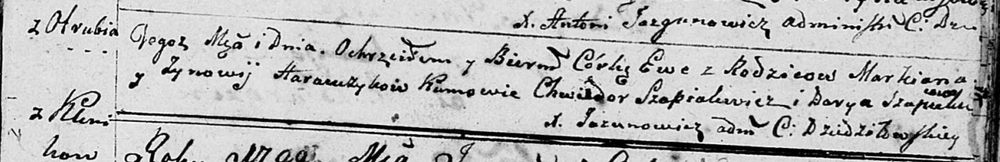

**Горавчик Анна Маркианова (Harauczykowna Anna Elżbieta)**

10 декабря 1805 г -- крещение (НИАБ 136-13-894, лист 59, №60/1805-р
(коп)).

**НИАБ 136-13-894:** Лист 59. **Метрическая запись №60/1805-р (ориг).**

{width="6.496527777777778in"
height="1.4214720034995625in"}

Дедиловичская Покровская церковь. 10 декабря 1805 года. Метрическая
запись о крещении.

Harauczykowna Anna Elżbieta -- дочь родителей с деревни Отруб.

Harauczyk Markian -- отец.

Harauczykowa Zynowia -- мать.

Czaplay Karp -- кум.

Harauczykowa Nasta -- кума.

Jazgunowicz Antoni -- ксёндз.
