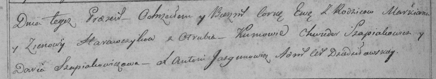

**Горавчик Ева Маркианова (Harauczykowna Ewa)**

27 декабря 1798 г -- крещение (НИАБ 136-13-894, лист 33, №27/1797-р
(коп)), (РГИА 823-2-18, лист 267об, №67/1798-р (коп)).

**НИАБ 136-13-894:** Лист 38. **Метрическая запись №66/1798-р (ориг).**

{width="6.496527777777778in"
height="1.0560465879265093in"}

Дедиловичская Покровская церковь. 27 декабря 1798 года. Метрическая
запись о крещении.

Harauczykowna Ewa -- дочь родителей с деревни Отруб.

Harauczyk Markian -- отец.

Harauczykowa Zynowia -- мать.

Szapialewicz Chwiedor - кум.

Szapialewiczowa Darya - кума.

Jazgunowicz Antoni -- ксёндз.

**РГИА 823-2-18:** Лист 267об. **Метрическая запись №67/1798-р (коп).**

{width="6.496527777777778in"
height="1.1888888888888889in"}

Дедиловичская Покровская церковь. 27 декабря 1798 года. Метрическая
запись о крещении.

Harawczykowna Ewa -- дочь родителей с деревни Отруб.

Harawczyk Markian -- отец.

Harawczykowa Zienowija -- мать.

Szapialewicz Chwiedor -- кум.

Szapialewiczowa Daria -- кума.

Jazgunowicz Antoni -- ксёндз.
