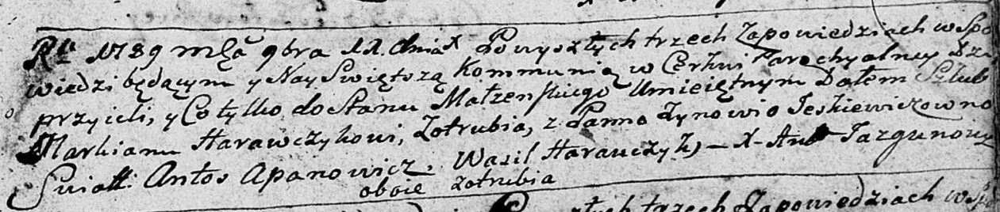
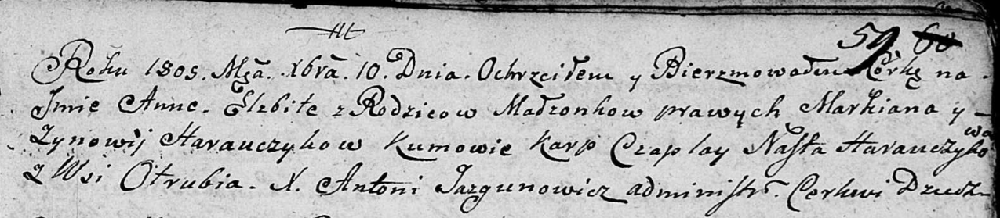

**Горавчик (Еськевич) Зыновия (Harauczykowa Zynowia z Eśkiewiczow)**

11 ноября 1789 г -- венчание с Маркианом Горавичком с деревни Отруб
(НИАБ 136-13-894, лист 68, №14/1797-р (ориг)).

27 декабря 1798 г -- крещение дочери Евы (НИАБ 136-13-894, лист 33,
№27/1797-р (ориг)), (РГИА 823-2-18, лист 267об, №67/1798-р (коп)).

5 февраля 1805 г -- крестная мать незаконнорожденной Магдалены, дочери
Элизабеты Мицки с деревни Отруб (НИАБ 937-4-32, лист 11, №6/1805-р).

10 декабря 1805 г -- крещение дочери Анны Елисаветы (НИАБ 136-13-894,
лист 59, №60/1805-р (коп)).

**НИАБ 136-13-894:** Лист 68. **Метрическая запись №14/1789-б (ориг).**

Дедиловичская Покровская церковь. 11 ноября 1789 года. Метрическая
запись о венчании.

Harawczyk Markian -- жених, с деревни Отруб.

Jeśkiewiczowna Zynowija -- невеста, с деревни Отруб.

Apanowicz Antoś -- свидетель.

Harauczyk Wasil -- свидетель.

Jazgunowicz Antoni -- ксёндз.

**НИАБ 136-13-894:** Лист 38. **Метрическая запись №66/1798-р (ориг).**

Дедиловичская Покровская церковь. 27 декабря 1798 года. Метрическая
запись о крещении.

Harauczykowna Ewa -- дочь родителей с деревни Отруб.

Harauczyk Markian -- отец.

Harauczykowa Zynowia -- мать.

Szapialewicz Chwiedor - кум.

Szapialewiczowa Darya - кума.

Jazgunowicz Antoni -- ксёндз.

**РГИА 823-2-18:** Лист 267об. **Метрическая запись №67/1798-р (коп).**

Дедиловичская Покровская церковь. 27 декабря 1798 года. Метрическая
запись о крещении.

Harawczykowna Ewa -- дочь родителей с деревни Отруб.

Harawczyk Markian -- отец.

Harawczykowa Zienowija -- мать.

Szapialewicz Chwiedor -- кум.

Szapialewiczowa Daria -- кума.

Jazgunowicz Antoni -- ксёндз.

**НИАБ 136-13-894:** Лист 11. **Метрическая запись №6/1805-р.**

Дедиловичский костел Наисвятейшего Сердца Иисуса. 5 февраля 1805 года.
Метрическая запись о крещении.

Micka Magdalena -- незаконнорожденная дочь.

Micka Elizabetha -- мать, с деревни Отруб.

Jhnacionek Andreas -- крестный отец, с деревни Отруб.

Horauczycha Zenovia -- крестная мать, с деревни Отруб.

Linhart Hiacinthus -- ксёндз.

**НИАБ 136-13-894:** Лист 59. **Метрическая запись №60/1805-р (ориг).**

Дедиловичская Покровская церковь. 10 декабря 1805 года. Метрическая
запись о крещении.

Harauczykowna Anna Elżbieta -- дочь родителей с деревни Отруб.

Harauczyk Markian -- отец.

Harauczykowa Zynowia -- мать.

Czaplay Karp -- кум.

Harauczykowa Nasta -- кума.

Jazgunowicz Antoni -- ксёндз.
