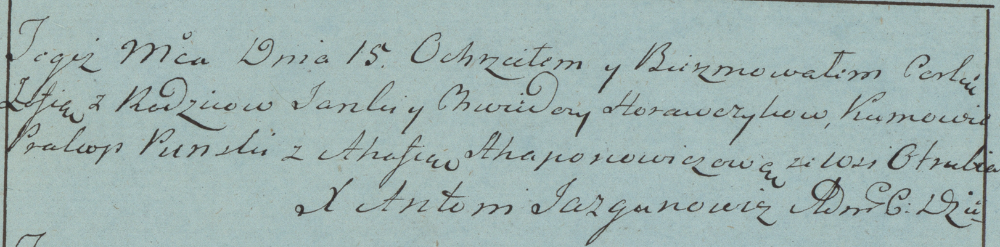

**Горавчик Зофья Янкова (Horawczykowna Zofia)**

15 сентября 1782г -- крещение (РГИА 823-2-18, лист 222об, №5/1782-р
(коп)).

**РГИА 823-2-18:** Лист 222об. **Метрическая запись №5/1782-р (коп).**

{width="6.496527777777778in"
height="1.60625in"}

Дедиловичская униатская церковь. 15 сентября 1782 года. Метрическая
запись о крещении.

Horawczykowna Zofia -- дочь родителей с деревни Отруб.

Horawczyk Janka -- отец.

Horawczykowa Chwiedora -- мать.

Punski Prokop -- кум.

Ahapanowiczowa Ahafia - кума.

Jazgunowicz Antoni -- ксёндз.
