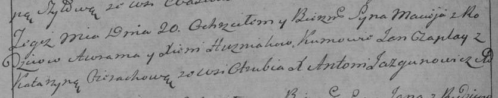

**Гузняк Аврам (Huzniak Awram)**

20 июня 1792 г -- крещение сына Мацея (НИАБ 136-13-894, лист 16,
№34/1792-р (ориг)), (РГИА 823-2-18, лист 244, №15/1792-р (коп)).

**НИАБ 136-13-894:** Лист 16. **Метрическая запись №34/1792-р (ориг).**

Дедиловичская Покровская церковь. 20 июня 1792 года. Метрическая запись
о крещении.

Huzniak Maciey -- сын родителей с деревни Отруб.

Huzniak Awram -- отец, селянин.

Huzniakowa Xienia -- мать, селянка.

Czaplay Jan - кум.

Cierachowa Katerzyna - кума.

Jazgunowicz Antoni -- ксёндз.

**РГИА 823-2-18:** Лист 244об. **Метрическая запись №15/1792-р (коп).**

Дедиловичская Покровская церковь. 20 июня 1792 года. Метрическая запись
о крещении.

Huzniak Maciey -- сын родителей с деревни Отруб.

Huzniak Awram -- отец.

Huzniakowa Xienia -- мать.

Czaplay Jan -- кум.

Cierachowa Katarzyna -- кума.

Jazgunowicz Antoni -- ксёндз.
