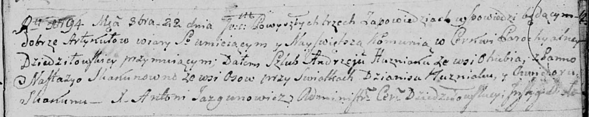

**Гузняк Андрей (Huzniak Andrzey)**

22 октября 1794 г -- венчание с Настасьей Скакун с деревни Осово (НИАБ
136-13-920, лист 1, №6/1794-б (ориг)).

**НИАБ 136-13-920:** Лист 1. **Метрическая запись №6/1794-б (ориг).**

Дедиловичская Покровская церковь. 22 октября 1794 года. Метрическая
запись о венчании.

Huzniak Andrzey -- жених, деревня Отруб.

Skakunowna Nastazya -- невеста, деревня Осовo.

Huzniak Dzianis -- свидетель.

Skakun Chwiedor -- свидетель.

Jazgunowicz Antoni -- ксёндз.
