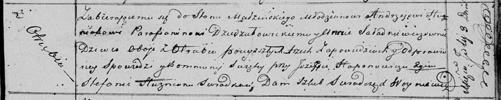

**Гузняк Андрей (Huzniak Andrzey)**

8 июля 1820 г -- венчание с девкой Анной Саладкевич с деревни Отруб
(НИАБ 136-13-920, лист 27, №3/1820-б (ориг)).

**НИАБ 136-13-920:** Лист 27. **Метрическая запись №3/1820-б (ориг).**

Осовская Покровская церковь. 8 июля 1820 года. Запись о венчании.

Huzniak Andrzey -- жених, молодой, парафии Дедиловичской католической, с
деревни Отруб.

Saładkiewiczowna Anna -- невеста, девка, парафии Осовской, с деревни
Отруб.

Haponowicz Jozef -- свидетель.

Huzniak Stefan -- свидетель.

Woyniewicz Tomasz -- ксёндз.
