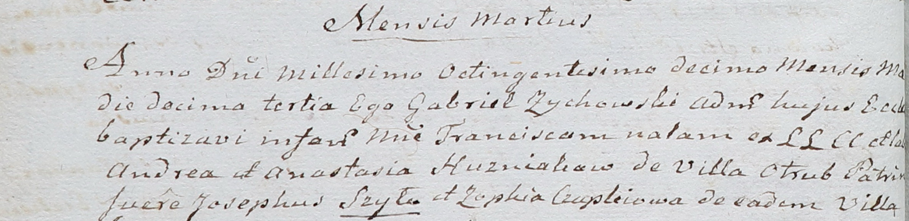

**Гузняк Франциска Андреева (Huzniakowna Francisca)**

13 марта 1810 г -- крещение (НИАБ 937-4-32, лист 21об, №11/1810-р).

**НИАБ 937-4-32:** Лист 21об. **Метрическая запись №11/1810-р.**

Дедиловичский костел Наисвятейшего Сердца Иисуса. 13 марта 1810 года.
Метрическая запись о крещении.

Huzniakowna Francisca -- дочь крестьян с деревни Отруб.

Huzniak Andreas -- отец.

Huzniakowa Anastasia -- мать.

Szyło Joseph -- крестный отец.

Czaplaiowa Zophia -- крестная мать, с деревни Отруб.

Zychowski Gabriel -- ксёндз.
