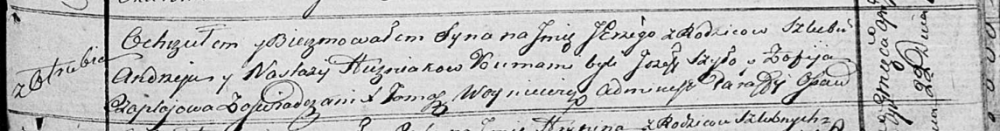

**Гузняк Юрий Андреев (Huzniak Jerzy)**

22 апреля 1817 г -- крещение (НИАБ 136-13-894, лист 96, №29/1817-р
(ориг)).

**НИАБ 136-13-894:** Лист 96. **Метрическая запись №29/1817-р (ориг).**

Осовская Покровская церковь. 22 апреля 1817 года. Метрическая запись о
крещении.

Huzniak Jerzy -- сын родителей с деревни Отруб.

Huzniak Andrzey -- отец.

Huzniakowa Nastazija -- мать.

Szyło Jerzy -- кум.

Czaplajowa Zofija -- кума.

Woyniewicz Tomasz -- ксёндз.
