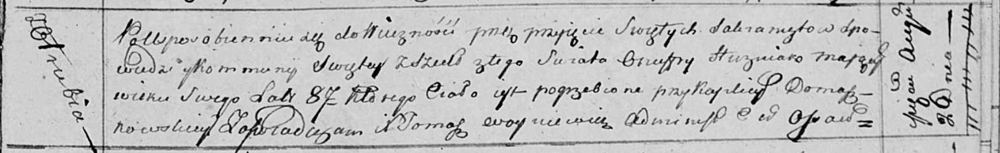

**Гузняк Онуфры (Huzniak Onufry)**

26 августа 1814 г -- отпевание, умер в возрасте 87 лет (родился около
1727 г) (НИАБ 136-13-919, лист 28, №5/1814-у (ориг)).

**НИАБ 136-13-919:** Лист 28. **Метрическая запись №5/1814-у (ориг)**

{width="6.496527777777778in"
height="0.9979166666666667in"}

Осовская униатская церковь. 26 августа 1814 года. Метрическая запись об
отпевании.

Huzniak Onufry -- умерший, 87 лет, с деревни Отруб, похоронен при
каплице Домашковичской.

Woyniewicz Tomasz -- ксёндз.
