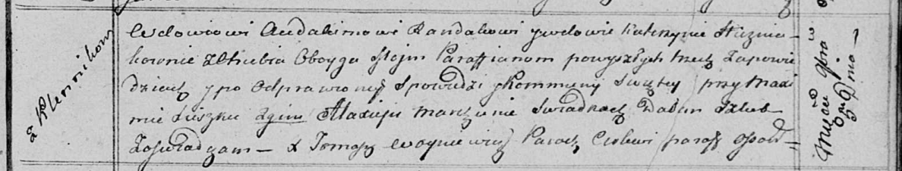

**Гузняк Парася (Huzniakowa Parasia)**

23 сентября 1807 г -- крестная мать Паланеи, дочери Синяков Демида и
Анны с деревни Клинники (НИАБ 136-13-894, лист 63об, №40/1807-р (ориг)).

**НИАБ 136-13-894:** Лист 63об. **Метрическая запись №40/1807-р
(ориг).**

{width="6.496527777777778in"
height="1.082866360454943in"}

Дедиловичская Покровская церковь. 23 сентября 1807 года. Метрическая
запись о крещении.

Siniakowna Pałanieja -- дочь родителей с деревни Клинники.

Siniak Dziamid -- отец.

Siniakowa Anna -- мать.

Czaplay Karp -- кум, с деревни Отруб.

Huzniakowa Parasia -- кума, с деревни Отруб.

Jazgunowicz Antoni -- ксёндз.
