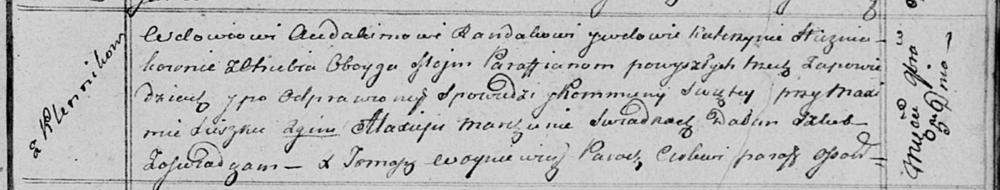

**Гузняк Прокоп (Huzniak Prokop)**

12 октября 1795 г -- отпевание, умер в возрасте 60 лет (родился около
1735 г) (НИАБ 136-13-919, лист 5об, №34/1795-у (ориг)).

**НИАБ 136-13-919:** Лист 5об. **Метрическая запись №34/1795-у (ориг).**

{width="6.496527777777778in"
height="1.7236111111111112in"}

Дедиловичская Покровская церковь. 12 октября 1795 года. Метрическая
запись об отпевании.

Huzniak Prokop -- умерший, 60 лет, с деревни Отруб, похоронен при филии
Домашковичской.

Jazgunowicz Antoni -- ксёндз.
