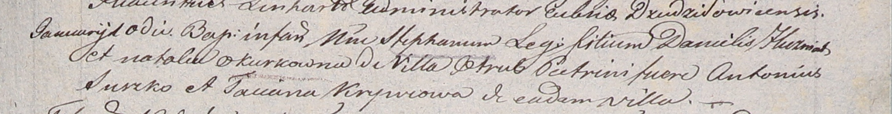

**Гузняк Данила (Huzniak Daniel)**

10 января 1806 г -- крещение сына Стефана (НИАБ 937-4-32, лист 13,
№2/1806-р).

**НИАБ 937-4-32:** Лист 13. **Метрическая запись №2/1806-р.**

{width="6.496527777777778in"
height="0.8354166666666667in"}

Дедиловичский костел Наисвятейшего Сердца Иисуса. 10 января 1806 года.
Метрическая запись о крещении.

Huzniak Stephan -- сын родителей с деревни Отруб.

Huzniak Daniel -- отец.

Huzniakowa Natalia z Okurkow -- мать.

Suszko Antoni -- крестный отец.

Krywcowa Taciana -- крестная мать, с деревни Отруб.

Linhart Hiacinthus -- ксёндз.
