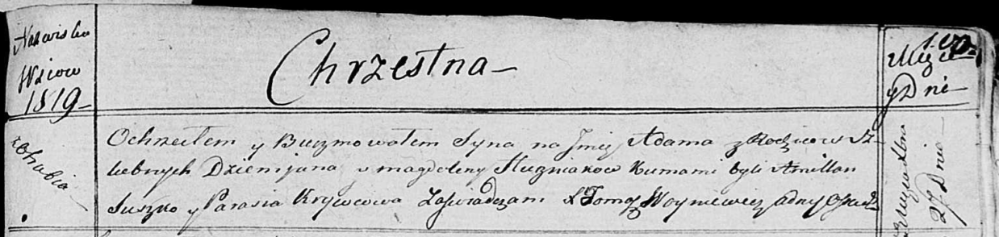

**Гузняк Магдалена (Huzniakowa Magdalena)**

17 октября 1815 г -- крещение дочери Текли (НИАБ 136-13-894, лист 93,
№38/1815-р (ориг)).

27 декабря 1818 г -- крещение сына Адама (НИАБ 136-13-894, лист 100,
№46/1818-р (ориг)).

**НИАБ 136-13-894:** Лист 93. **Метрическая запись №38/1815-р (ориг).**

{width="6.496527777777778in"
height="0.8696456692913386in"}

Осовская Покровская церковь. 17 октября 1815 года. Метрическая запись о
крещении.

Huzniakowna Tekla -- дочь родителей с деревни Отруб.

Huzniak Dziemjan -- отец.

Huzniakowa Magdalena -- мать.

Suszko Amillan -- кум.

Krywcowa Magdalena -- кума.

Woyniewicz Tomasz -- ксёндз.

**НИАБ 136-13-894:** Лист 100. **Метрическая запись №46/1818-р (ориг).**

{width="6.496527777777778in"
height="1.542833552055993in"}

Осовская Покровская церковь. 27 декабря 1818 года. Метрическая запись о
крещении.

Huzniak Adam -- сын родителей с деревни Отруб.

Huzniak Dziemjan -- отец.

Huzniakowa Magdalena -- мать.

Suszko Amillan -- кум.

Krywcowa Parasia -- кума.

Woyniewicz Tomasz -- ксёндз.
