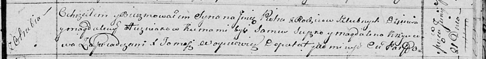

**Гузняк Денис (Huzniak Dzianis)**

31 января 1809 г -- венчание с девкой Магдаленой Селицкой (НИАБ
136-13-920, лист 15, №4/1809-б (ориг)).

21 июня 1814 г -- крещение сына Петра (НИАБ 136-13-894, лист 90,
№38/1814-р (ориг)).

**НИАБ 136-13-920:** Лист 15. **Метрическая запись №4/1809-б (ориг).**

Дедиловичская Покровская церковь. 31 января 1809 года. Метрическая
запись о венчании.

Huzniak Dzianis -- жених, вдовец, с деревни \[Отруб\].

Sialicka Magdalena -- невеста, девка.

Hapanowicz Jozef -- свидетель, с деревни Отруб.

Sialicki Anani -- свидетель, с деревни Домашковичи.

Jazgunowicz Antoni -- ксёндз.

**НИАБ 136-13-894:** Лист 90. **Метрическая запись №38/1814-р (ориг).**

Осовская Покровская церковь. 21 июня 1814 года. Метрическая запись о
крещении.

Huzniak Piotr -- сын родителей с деревни Отруб.

Huzniak Dzienis -- отец.

Huzniakowa Magdalena -- мать.

Suszko Samuś -- кум.

Krzywcowa Magdalena -- кума.

Woyniewicz Tomasz -- ксёндз.
