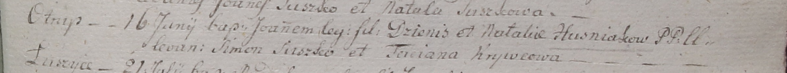

**Гузняк Ян Денисов (Huzniak Joann)**

16 июня 1799 г -- крещение сына Яна (НИАБ 1781-27-199, лист 128,
№30/1799-р).

**НИАБ 1781-27-199:** Лист 128. **Метрическая запись №30/1799-р.**

{width="6.496527777777778in"
height="0.6097222222222223in"}

Дедиловичский костел Наисвятейшего Сердца Иисуса. 16 июня 1799 года.
Метрическая запись о крещении.

Huzniak Joann -- сын крестьян с деревни Отруб.

Huzniak Dzienis -- отец.

Huzniakowa Natalia -- мать.

Suszko Simon -- крестный отец.

Krywcowa Taciana -- крестная мать.

Linhart Hyacinthus -- ксёндз.
