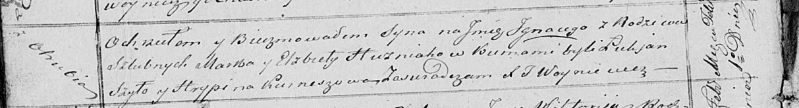

**Гузняк Игнацы Марков (Huzniak Jgnacy)**

1 февраля 1821 г -- крещение (НИАБ 136-13-894, лист 105об, №4/1821-р
(ориг)).

**НИАБ 136-13-894:** Лист 105об. **Метрическая запись №4/1821-р
(ориг).**

{width="6.496527777777778in"
height="0.8837259405074366in"}

Осовская Покровская церковь. 1 февраля 1821 года. Метрическая запись о
крещении.

Huzniak Jhnacy -- сын родителей с деревни Отруб.

Huzniak Marko -- отец.

Huzniakowa Elżbieta -- мать.

Szyło Łukjan -- кум.

Kurnieszowa Hrypina -- кума.

Woyniewicz Tomasz -- ксёндз.
