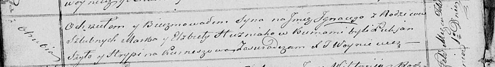

**Гузняк Марк (Huzniak Marko)**

11 июня 1817 г -- крещение сына Адама (НИАБ 136-13-894, лист 96об,
№40/1817-р (ориг)).

1 февраля 1821 г -- крещение сына Игнацыя (НИАБ 136-13-894, лист 105об,
№4/1821-р (ориг)).

**НИАБ 136-13-894:** Лист 96об. **Метрическая запись №40/1817-р
(ориг).**

Осовская Покровская церковь. 11 июня 1817 года. Метрическая запись о
крещении.

Huzniak Adam -- сын родителей с деревни Отруб.

Huzniak Markо -- отец.

Huzniakowa Elżbieta -- мать.

Szyło Łukjan -- кум.

Kurneszowa Hrypina -- кума.

Woyniewicz Tomasz -- ксёндз.

**НИАБ 136-13-894:** Лист 105об. **Метрическая запись №4/1821-р
(ориг).**

Осовская Покровская церковь. 1 февраля 1821 года. Метрическая запись о
крещении.

Huzniak Jhnacy -- сын родителей с деревни Отруб.

Huzniak Marko -- отец.

Huzniakowa Elżbieta -- мать.

Szyło Łukjan -- кум.

Kurnieszowa Hrypina -- кума.

Woyniewicz Tomasz -- ксёндз.
